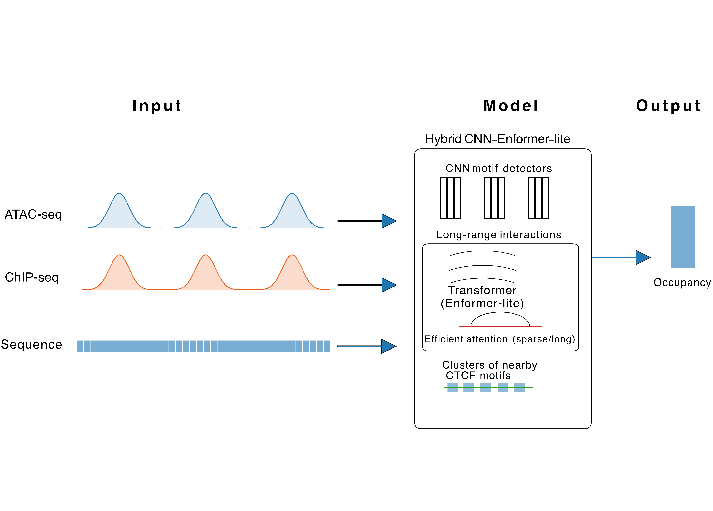

# 🧬 OccuFold

### Description
This repository contains a reproducible Nextflow (DSL2) pipeline that uses a neural-network model to predict CTCF occupancy (Convolutional Neural Network) from SMF/motif data and then prepares the inputs for loop-extrusion simulations to validate those predictions. It keeps key region fields, writes an occupancy track, and produces barrier lists plus a paramdict for simulations. The whole pipeline runs in a Singularity/Apptainer container for consistent, portable results.

<!--### Structure of the repository
The structure of this repository follows as below:
- processing/: Scripts and pipelines for NGS data processing (e.g., handling SMF methylation footprint data and ChIP-seq data).
#### 🧬 CTCF Binding Site Processing Pipeline-->

### Requirements

- Nextflow ≥ 24.10

<!-- - Java 11+ (for Nextflow)-->

- Singularity/Apptainer (tested with Singularity 3.8.x)

Required files:

- Reference genome FASTA (e.g., mm10.fa) and index in a readable location

- CTCF peaks BED/CSV/TSV (first 3 columns = chrom,start,end)

- Model weights file (see workflow/files/model_weights)

- CTCF PFM file (e.g., workflow/files/MA0139.1.pfm or .smooth.pfm)

### Install & Run (quick start)

1. Clone the repo
`git clone https://github.com/Fudenberg-Research-Group/OccupancyInputCTCF.git
cd OccupancyInputCTCF`

<!--`git clone https://github.com/hrahmanin/OccuFold.git
cd OccuFold`-->

3. Build the Singularity/Apptainer image
(use --remote if you don't have local root privileges)
`singularity build --remote occufold.sif singularity.def`

4. Run the pipeline (predicted occupancy mode)
note: Replace /path/to/CTCF_peaks.bed with your own peaks file.
If you don't have peaks, you can DROP the --peaks line.
`nextflow run main.nf -profile singularity \
  --region "chr1:10_000_000-11_500_590" \
  --peaks /path/to/CTCF_peaks.bed \
  --outdir results -resume`  

<!--#### 🔄 Pipeline Overview

1. **Load Data**  
   Load CTCF binding site coordinates and binding frequency table.

2. **Filter Sites**  
   Keep only sites with all three biological states:  
   _Accessible, Bound, Nucleosome-occupied_.

3. **Pivot Frequencies**  
   Reshape the table to have one row per site with frequency values for each state.

4. **Merge with Coordinates**  
   Combine genomic coordinates and binding frequency data into a single DataFrame.

5. **Extract Sequences**  
   Use `pyfaidx` to extract sequences from the mm10 reference genome.

6. **One-Hot Encode**  
   Convert sequences into 4×N matrices (A/C/G/T channels) for CNN input.

7. **Visualize**  
   Plot one-hot encoded sequences as grayscale "pixel" images for inspection.

8. **Save Outputs**  
   Write final annotated data to `sites_with_freqs_and_seqs.tsv`.-->

---
**Outputs**
- **Step 1:** `results/step1/REGION.csv` — region table (e.g., `chrom,start,end,mid,strand,...`).
- **Step 2:** `results/step2/REGION.occupancy.csv` — Step-1 columns **plus** model outputs (e.g., `Accessible,Bound,Nucleosome.occupied`).
- **Step 3:** `results/step3/REGION.occupancy.refined_occupancy.csv`, `barriers.csv`, `ctcf_lists.csv`, `paramdict.json`.
- **Step 4:** `results/step4/REGION.1d_sims`
- **Step 5:** `results/step5/Chip.png, Hi-C.png`

<!--#### 📁 Output

- `sites_with_freqs_and_seqs.tsv` – Final annotated file including:
  - `chrom`, `start`, `end`, `TFBS_cluster`
  - Frequency columns: `Bound`, `Accessible`, `Nucleosome.occupied`
  - DNA `sequence`-->

<!-- - models/: Code for deep learning models (CNN architectures, training scripts, evaluation functions) used to predict CTCF occupancy or 3D contacts
- analysis/: Notebooks or scripts for analyzing results (e.g. comparing predicted vs. actual Hi-C, generating figures).
- utils/: Utility functions and tools (shared helper code for data I/O, metric calculations, etc.).
- outputs/: Folder to store output files, such as processed data or model predictions (keeping them separate from code)-->

<!-- #### Processing simulation data
After running the workflow, the simulated trajectories can be processed to generate *in silico* ChIP-seq profiles, 1d contact maps, and 3d contact maps (optional). Scripts for data processing available in `processing`. Instructions are provided with the relevant python code.-->

